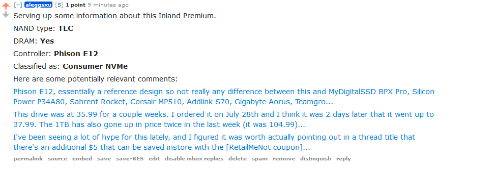

# Alex's Reddit bots

Currently limited to just ssd_bot.

## SSD Bot

**Built with:** Python, Flask, Google Sheets API, gspread, oauth2, and PRAW

### Core function

The core file, ssd_bot.py, is run every minute. It uses PRAW to scan r/buildapcsales for new posts, and when a submission is tagged with [SSD], it runs the main function. It then:

1. Calls Google Sheets API. It looks at NewMaxx's SSD spreadsheet, and updates an internal list of SSD brands and models.

2. Checks if the item in the title of the Reddit submission is included in the spreadsheet.

3. Looks up the item in the spreadsheet to find its row number.

4. Scans the row to get desired information.

5. Calls comment parsing to look up relevant comments.

5. Comments all that information on a submission.

### Comment parsing

The secondary function of SSD Bot is add relevant comments onto a post. 

1. During the setup phase, it compiles all comments from r/buildapcsales that match the brand and model of the current post into comments.db. 

2. comments.db tracks comment ID, number of keyword matches, brand, model, comment permalink, comment score, and the text in the body of the comment.

3. When the main file is run, it looks through the database and attempts to pick out the most relevant comments.

4. It returns those comments to the core function.
